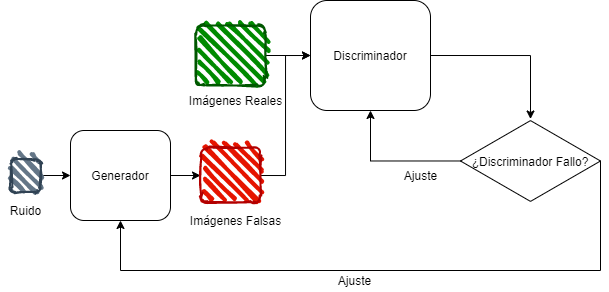

# Generation of synthetic images using GANs

  

## Documentation in English

This repository shows the methodology to implement an **Generative Adversarial Neural Network** architecture to generate synthetic images from Gaussian noise.

The whole process is described step by step in the Jupyter Notebooks, but for this moment all the comments are on spanish, but in this section you could find a brief explanation. The architecture performance tests are done with two databases:

- The widely used MNIST, database of handwritten numbers.
- Aerial images of coffee plantations are used as a second database.

Both databases are compressed in _source.zip_ and it is necessary to unzip them in the same directory as the Jupyter notebooks.

## How does the architecture work?

In general, the way generative adversarial networks works is having two convolutional networks competing with each other. The first one, is called the _Generator_, and its purpose is create artificial images from Gaussian noise, and the target is to fool the second artificial network, named _Discriminator_.

The _Discriminator_ is train with original images and will try to differentiate between the real images and the one that are made by the _Generator_.

  
  Figure 1. Block diagram of the GAN's functionality.

 
 

## Documentación en Español (Documentation in Spanish)

En este repositorio se muestra la metodología para implementar una arquitecura de **Red Neuronal Adversaria** para generar imágenes sintéticas a partir de ruido gaussiano.

Todo el proceso se describe paso por paso en los Jupyter Noteeboks. Las pruebas del funcionamiento de la arquitectura se hacen con dos bases de datos:

- El ampliamente usado MNIST, base de datos de números escritos a mano.
- Como segunda base de datos se utiliza imágenes aereas de plantaciones de café.

Ambas bases de datos se encuentran comprimidas en _source.zip_ y es necesario descomprimirlas en el directorio donde están los Jupyter notebooks.

## ¿Cómo funciona la arquitectura?

En general el funcionamiento de las redes adversarias consiste en tener dos redes convolutivas compitiendo entre ellas. La primera, denominada _Generadora_, va a tratar de crear imágenes a partir de ruido Gaussiano y su objetivo es engañar a la segunda red neuronal, llamada _Discriminadora_.

La _Discriminadora_ es entrenada con las imágenes reales y su objetivo es distinguir entre estas imágenes originales y las creadas por la red _Generadora_.

  
  Figura 1. Diagrama de bloques de la funcionalidad de la GAN.

